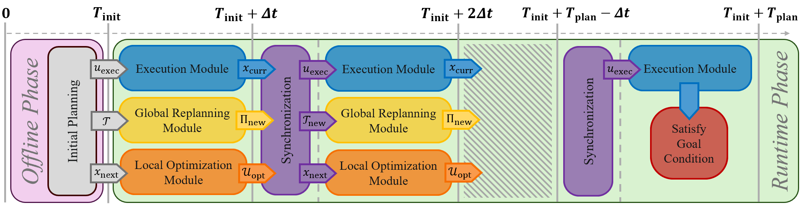
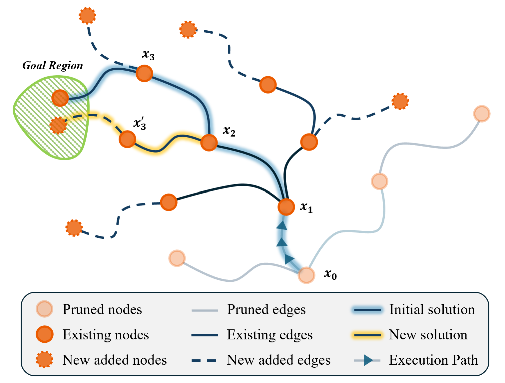
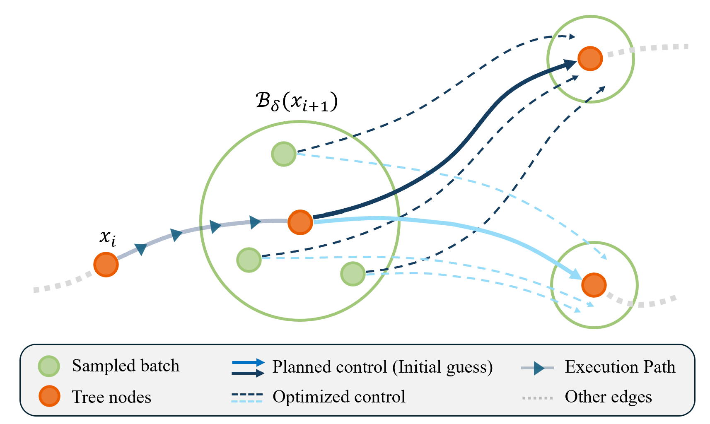
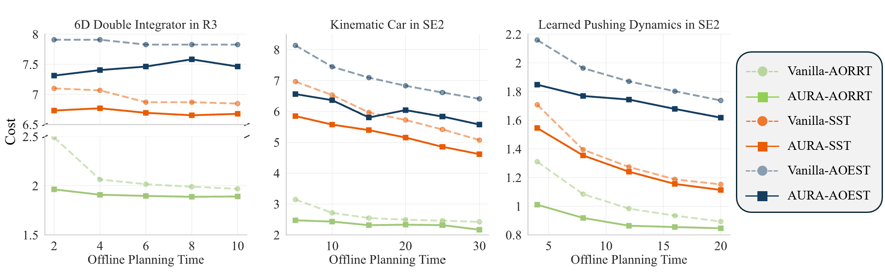
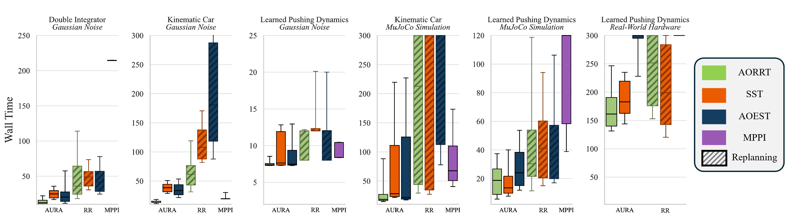
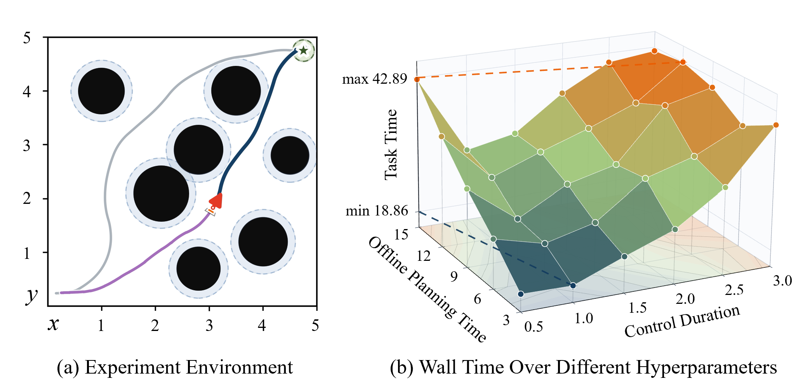

# AURA: Asymptotically-Optimal Uncertainty-Robust Replanning Algorithm for Kinodynamic Systems

<p align="center">
  
</p>
<p align="center">
  
  &nbsp;&nbsp;
  
</p>
AURA is a meta-planner framework for kinodynamic motion planning under motion uncertainty. It combines an asymptotically optimal sampling-based planner with online replanning and local control optimization, so execution can keep improving the planned trajectory while correcting tracking error.

Paper: [AURA: Asymptotically Optimal Uncertainty-Robust Replanning Algorithm for Kinodynamic Systems](https://arxiv.org/abs/2605.27699)

## Repository Layout
```text
AURA/
├── AURA.py                         # Main AURA execution loop
├── Replanning.py                   # Restart replanning baseline
├── optimization.py                 # Local control optimization used by AURA
├── plan.py                         # OMPL planning wrapper and solution extraction
├── systems.py                      # Dynamical system definitions and OMPL spaces
├── train_model.py                  # Learned pushing dynamics training/loading utilities
├── run_initial_time_experiments.sh # Initial-planning-time sweep wrapper
├── run_performance_experiments.sh  # Wall-time comparison wrapper
├── run_error_experiments.sh        # Tracking-error experiment wrapper
├── configs/                        # YAML files for experiment configs
├── experiments/                    # Evaluation experiments
├── simulation/                     # Gaussian/MuJoCo simulation and assets
├── real_world/                     # UR10 / camera
├── geometry/                       # Geometry, poses, trajectories, object utilities
├── models/                         # Neural model definitions and loss functions
├── learned_models/                 # Trained models
├── scripts/                        # Plotting and result visualization scripts
├── utils/                          # Shared helpers and config/result utilities
└── docs/results/                   # README images
```

## Main Algorithm Files
### `AURA.py`
This file contains the class for main runtime algorithm. It starts from an initial OMPL solution, executes controls through a simulator or real-world interface, runs replanning and local optimization in parallel, and chooses the next control based on true observed state and the best current plan.

- `AURA.AURAResult`: Structured return object with final state, cost, tracking error, trajectories, final plan, and status.
- `AURA.run(...)`: The main execution loop. It executes the next control, compares actual vs predicted state, manages replanning/optimization threads, and records trajectories.
- `AURA.replanning(...)`: Continues resolving the planner while execution is happening.
- `pick_next_control(...)`: Chooses between the best optimized control for the next execution cycle.

### `optimization.py`
This file implements the local control optimizer used by AURA. It samples possible future execution states around the next state, evaluates candidate controls against reachable child states, and uses PyTorch to find controls that reduce expected tracking error. The optimizer is intentionally set to be anytime. `AURA` only has one execution window to use the result, so the optimizer returns the best available control within the deadline.

### `plan.py`
Here is the wrapper for OMPL planning for the supported systems. It builds the OMPL simple setup, initializes propagators and validity checks, runs planners, extracts exact solutions, and converts OMPL paths into state/control/time arrays. It handles:
- Planner selection (`aorrt`, `aoest`, and `sst`)
- Start/goal setup,
- Control duration and propagation step configuration,
- Obstacle and state-validity checking,

### `Replanning.py`
This file contains `ReplanningRunner`, the from-scratch-planning baseline. Unlike AURA, which preserves and improves an existing planning tree during execution, this baseline plans from the latest observed state.

### `systems.py`
The planning systems and their dynamics are defined here:
- `kinematicCar`: SE(2) non-holonomic car with velocity/steering controls.
- `doubleIntegrator`: 3D double-integrator in a 6D state space.
- `pushingObject`: SE(2) object pushing dynamics backed by the learned pushing model.

Each system defines:
- OMPL state and control spaces,
- State/control bounds,
- NumPy propagation,
- OMPL propagators,
- Dynamics wrappers.

For a new task, this is the place to define its dynamics and planning spaces.

## Folders
### `configs/`
YAML configuration files for experiment batches.
- `initial_time_experiment.yaml`: Settings for the initial planning time experiment.
- `performance_double_integrator.yaml`: Settings for the wall time comparison.

The runner scripts load these configs by default, but terminal arguments can override them.

### `experiments/`
Evaluation scrips:
- `cost_comparison_experiment.py`: compares planner solution costs over different offline planning-time budgets,
- `error_experiment.py`: compares open-loop tracking error against optimized-control,
- `real_error_experiment.py`: real-robot version of the tracking-error experiment,
- `wall_time_experiment.py`: compares wall-time performance of AURA and RestartReplanning,
- `initial_time_experiment.py`: runs AURA on the kinematic car while sweeping initial planning time and control duration.


Use the root bash wrappers for normal runs:

```bash
./run_initial_time_experiments.sh
./run_performance_experiments.sh
./run_error_experiments.sh
```

### `simulation/`
Simulation packages:
- `simulators.py`: common simulator interface and factory, plus Gaussian-noise simulators,
- `mujoco_car.py`: MuJoCo kinematic-car simulator,
- `mujoco_pushing.py`: MuJoCo UR10/object-pushing simulator,
- `mujoco_video_renderer.py`: offscreen MuJoCo video rendering helper,
- `mink_ik.py`: MuJoCo/Mink inverse-kinematics helper,
- `pushing_dynamics.py`: learned pushing model loader,
- `pushing_object_specs.py`: object dimensions for pushing,
- `sim_demo.py`: demo launcher for simulated systems,
- `visualize_mujoco_methods.py`: presentation-quality method visualizations,
- `assets/`: MuJoCo XML files, meshes, object assets, and car models.

### `real_world/`
Real hardware support for UR10 execution:
- `real_execution.py`: runs AURA or RestartReplanning on the physical robot,
- `physical_robot.py`: main class for physical robot interface,
- `camera.py`, `gripper.py`, `rtde.py`: hardware communication helpers.

### `geometry/`
Geometry utilities used by planning, pushing, and visualization:
- `pose.py`: pose conversions, quaternions, Euler angles, SE(2)/SE(3) helpers,
- `random_push.py`: push parameter sampling and workspace path generation,
- `trajectory.py`: trajectory interpolation utilities,
- `object_model.py`: object shape helpers,
- `point_cloud.py`: point-cloud utilities for mesh assets.

### `models/`
Neural network model definitions and losses:
- `model.py`, `torch_model.py`: MLP and model wrappers,
- `torch_loss_se2.py`: SE(2)-aware loss functions and uncertainty-aware losses,
- `physics.py`: simple analytic pushing equations.

### `learned_models/`
Trained weights used by the pushing system. These files are needed when running the learned pushing model.

### `scripts/`
Plotting and post-processing scripts:
- `plotting.py`: general workspace plotting, replay rendering, and demo plotting utilities,
- `plotPerformance.py`: aggregate experiment plotting for performance metrics,
- `plot_workspace_replay_surfaces.py`: summary plots from saved workspace replays.

### `utils/`
Shared utilities:
- `configHandler.py`: config parsing and experiment-grid helpers,
- `auraHandler.py`: AURA logging, diagnostics, and loss plotting helpers,
- `solutionsHandler.py`: OMPL solution extraction helpers,
- `childrenHandler.py`: planner tree child extraction,
- `dataLoader.py`: data loading helpers,
- `threadHandler.py`: older threaded execution helpers,
- `utils.py`: common math, distance, state conversion, validity, and sampling helpers.

## Evaluation
The commands below use option templates. Replace bracketed values such as `[aorrt|aoest|sststar]`, `[N]`, and `[DIR]` with the values you want to run.

### Cost Comparison
Compares planner solution costs over different offline planning-time budgets.
```bash
python experiments/cost_comparison_experiment.py \
  --planner-name [aorrt|aoest|sststar|all] \
  --planning-times [SECONDS] \
  --num-runs [N] \
  --results-dir [DIR] \
  --seed [N]
```

### Tracking-Error Evaluation
Runs the naive-vs-optimized tracking-error experiment.
```bash
./run_error_experiments.sh \
  [kinematic_car|double_integrator|pushing_object] \
  [gaussian|mujoco] \
  --num-controls [N] \
  --num-trials [N] \
  --duration [SECONDS] \
  --optimizer-num-states [N] \
  --optimizer-learning-rate [FLOAT]
```

### Wall-Time Evaluation
Compares AURA and RestartReplanning on the double-integrator task (default).
```bash
./run_performance_experiments.sh \
  --planner-name [aorrt|aoest|sststar|all] \
  --method [aura|replanning|both] \
  --num-runs [N] \
  --results-dir [DIR] \
  --planning-time [SECONDS] \
  --replanning-time [SECONDS] \
  --max-steps [N] \
  [--overwrite]
```
To run exactly one repeat, use `--run-number [N]` instead of `--num-runs [N]`.

### Hyperparameter Analysis
Runs AURA over control durations and initial planning times. The default config is `configs/initial_time_experiment.yaml`.
```bash
./run_initial_time_experiments.sh \
  --planner-name [aorrt|aoest|sststar] \
  --control-durations [SECONDS] \
  --planning-times [SECONDS] \
  --num-runs [N] \
  --results-dir [DIR] \
  --optimizer-num-states [N] \
  --optimizer-num-steps [N] \
  --optimizer-learning-rate [FLOAT] \
  --recovery-replanning-time [SECONDS]
```
Outputs include CSV summaries, PNG plots, and workspace replay files under `results/`.

### Real-World Execution

Real-world execution is not wrapped by a root bash script because it requires hardware and operator supervision.

```bash
/usr/bin/python3 real_world/real_execution.py \
  --method [aura|replanning] \
  --goal [X Y THETA] \
  --planning-time [SECONDS] \
  --replanning-time [SECONDS] \
  --max-runs [N]
```

## Results
### Cost Comparison


### Wall-Time Evaluation


### Hyperparameters Analysis


### MuJoCo / Simulation Videos


## Typical Development Workflow
1. Edit planner/system/AURA code.
2. Run syntax checks:

   ```bash
   bash -n run_initial_time_experiments.sh run_performance_experiments.sh run_error_experiments.sh
   python -m py_compile AURA.py Replanning.py systems.py optimization.py plan.py
   ```

3. Run the smallest useful experiment commands from the option templates above. For example, set `[N]` to `1`, use one planner, and use short planning/control durations.

4. Inspect generated CSV/plot/replay files under `results/`.
5. Run the larger configured sweeps only after the small runs pass.

## Notes
- MuJoCo assets live under `simulation/assets/`.
- The real-world scripts require hardware.
- If PyTorch prints `Can't initialize NVML`, CUDA monitoring is unavailable in the current environment. CPU execution can still work, but GPU optimizer acceleration will not be available.
