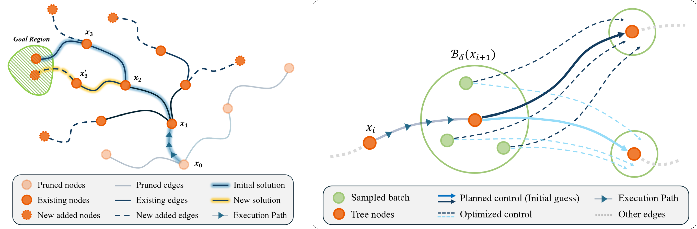

# AURA: Asymptotically-Optimal Uncertainty-Robust Replanning Algorithm for Kinodynamic Systems




AURA is a meta-planning framework for kinodynamic motion planning under motion uncertainty. It combines an asymptotically optimal sampling-based planner, concurrent replanning, and differentiable local control optimization to improve a nominal trajectory while correcting execution error.

## Contents

1. [Installation](#installation)
2. [Repository Layout](#repository-layout)
3. [Main Algorithm Files](#main-algorithm-files)
4. [Configuration](#configuration)
5. [Experiments](#experiments)
6. [Real-World Execution](#real-world-execution)
7. [Results](#results)
8. [Reproducibility Notes](#reproducibility-notes)

## Installation

The project uses Python 3.10 and a custom OMPL build containing `AORRT`, `AOEST`, and `SSTStar`.

```bash
python3.10 -m pip install -r requirements.txt
AURA_OMPL_SOURCE=/path/to/ompl \
  AURA_PYTHON_BIN=python3.10 \
  bash scripts/build_ompl.sh
```

`requirements.txt` installs the Python dependencies, including the pinned MuJoCo version and real-world interfaces. It intentionally does not install the unrelated PyPI `ompl` package. The custom planner sources backed up under `planners/` must be present in the OMPL source tree supplied through `AURA_OMPL_SOURCE` before building.

The experiment launchers configure the repository-local OMPL and Torch library paths automatically. To run tests directly, expose the local OMPL installation:

```bash
export PYTHONPATH="$PWD/.deps/ompl/lib/python3.10/site-packages:$PWD/.deps/python${PYTHONPATH:+:$PYTHONPATH}"
export LD_LIBRARY_PATH="$PWD/.deps/ompl/lib${LD_LIBRARY_PATH:+:$LD_LIBRARY_PATH}"
python3.10 -m pytest -q
```

## Repository Layout

```text
AURA/
├── aura/
│   ├── AURA.py                    # AURA execution and replanning loop
│   └── optimization.py            # Batched local control optimization
├── methods/
│   ├── plan.py                    # OMPL setup, durations, and solution extraction
│   ├── Replanning.py              # From-scratch replanning baseline
│   ├── MPPI.py                    # Vectorized MPPI controller
│   └── RandUpRRT.py               # Particle-based robust RRT baseline
├── propagators/                   # One dynamics/OMPL adapter per system
├── planners/                      # Backups of custom OMPL planner sources
├── configs/
│   ├── systems/                   # Dynamics, bounds, tasks, and environments
│   └── experiments/               # Methods and experiment hyperparameters
├── experiment/                    # Five experiment entry points
├── simulation/                    # Gaussian and MuJoCo execution backends
├── real_world/                    # UR10, camera, RTDE, and hardware execution
├── geometry/                      # Pose, object, point-cloud, and push geometry
├── models/                        # Learned-model definitions and losses
├── learned_models/                # Trained pushing checkpoints
├── scripts/                       # Launchers, plotters, and visualization tools
├── utils/                         # Shared planner and experiment helpers
├── tests/                         # Unit and integration checks
└── train_model.py                 # Pushing-model training/loading utilities
```

## Main Algorithm Files

### `aura/AURA.py`

Defines the main `AURA` runtime. It executes a nominal control, observes the resulting state, continues resolving the planning tree, optimizes recovery controls concurrently, and selects the next executable edge. `AURA.AURAResult` records the final state, trajectory cost, tracking errors, controls, durations, timing, replanning count, and terminal status.

### `aura/optimization.py`

Implements duration-aware local control optimization with PyTorch. It samples possible execution states, propagates candidate controls through the analytical or learned dynamics, and minimizes the expected state error to reachable child states. Gradients are obtained through PyTorch autograd for the differentiable dynamics.

### `methods/plan.py`

Owns the common OMPL planning interface:

- canonical planner selection: `aorrt`, `aoest`, `sststar`, or `randup_rrt`;
- state and control spaces, validity checking, and planning objectives;
- propagation-step and variable-duration conversion;
- start/goal configuration and exact-solution extraction; and
- typed control edges containing source, target, control, duration steps, and duration seconds.

### `methods/Replanning.py`

Defines the restart-replanning baseline. It discards the current tree and plans again from the latest observed state when recovery is required.

### `methods/MPPI.py`

Defines a vectorized Model Predictive Path Integral controller for all four supported systems. It uses the same nominal dynamics, bounds, state conventions, learned pushing model, simulator, and task goal as the planning methods.

### `methods/RandUpRRT.py`

Implements the finite-particle robust-RRT baseline shown as **RobRRT** in the task-time figure. Each node stores a nominal state and a particle cloud. Every edge propagates the nominal state and all particles for the sampled duration; particle disturbances are independent, and the configured goal test can require every particle to enter the goal region.

This is a sampled reachable-set approximation inspired by Robust-RRT, not an exact continuous reachable-set implementation. Its safety checks apply to the represented particles plus optional geometric padding, so the exact Robust-RRT completeness theorem is not claimed for these experiments.

### `propagators/`

The four canonical systems are:

- `double_integrator`
- `dubins_airplane`
- `kinematic_car`
- `pushing_object`

Each system file owns its OMPL spaces, bounds, NumPy propagation, differentiable Torch propagation, OMPL adapter, and system-specific random-state sampling. `propagators/propagator.py` contains the shared `System` contract and numerical integration helpers. `propagators.get_system()` accepts only the canonical names above; there are no compatibility aliases.

### `planners/`

Contains repository backups of the nonstandard OMPL planner sources:

- `planners/aorrt/aorrt.{h,cpp}`
- `planners/aoest/AOEST.{h,cpp}`
- `planners/sststar/SSTStar.{h,cpp}`

The runtime imports these planners from the custom OMPL Python binding built by `scripts/build_ompl.sh`.

## Configuration

Configuration is split into one file per system and one file per experiment:

```text
configs/
├── systems/
│   ├── double_integrator.yaml
│   ├── dubins_airplane.yaml
│   ├── kinematic_car.yaml
│   └── pushing_object.yaml
└── experiments/
    ├── trajectory_cost.yaml
    ├── deviation_error.yaml
    ├── task_time_efficiency.yaml
    ├── initial_time_sensitivity.yaml
    └── recovery_condition.yaml
```

System files contain dynamics, state/control bounds, start and goal states, obstacles, learned models, and Gaussian/MuJoCo/real-world environment settings. Experiment files contain the methods, planner/controller hyperparameters, seeds, trial counts, budgets, and canonical output directory. Each runner loads and merges the relevant layers automatically.

## Experiments

The checked-in launchers use the configured canonical output directory. Repeating a trial rewrites that trial in the same experiment directory; a new folder is not created for every tuning setting.

### Trajectory Cost Comparison

Compares AURA-refined and vanilla `AORRT`, `AOEST`, and `SSTStar` trajectories without execution noise.

```bash
scripts/trajectory_cost.sh
python3.10 scripts/plot_trajectory_cost.py
```

Default output: `results/trajectory_cost_comparison/`.

### Deviation-Error Comparison

Compares step-wise tracking error for AURA, MPPI, and open-loop execution on fixed nominal references. The runner also generates its summary tables and figure.

```bash
scripts/deviation_error.sh
```

Default output: `results/error_experiment/`.

### End-to-End Task-Time Efficiency

Compares AURA, restart replanning (RR), MPPI, and the particle-based RobRRT baseline. The configured campaign covers double integrator, kinematic car, 6D Dubins airplane, and learned pushing under Gaussian noise, plus the kinematic-car and pushing MuJoCo tasks.

```bash
scripts/task_time_efficiency.sh --resume --max-parallel 1
```

The launcher defaults to all active baselines and the trial count in `configs/experiments/task_time_efficiency.yaml`. It freezes a campaign manifest, resumes completed rows when requested, validates the result matrix, and regenerates the task-time figure. To regenerate the figure from the current saved data without rerunning trials:

```bash
python3.10 scripts/plot_task_time.py
```

Default output: `results/full_time_comparison/`. The plotter uses every available run for each method independently; trial counts are not hard-coded or required to match.

Planner edges use one inseparable `(source, target, control, duration_steps, duration_seconds)` contract. AURA and RR use the sampled variable edge duration. MPPI executes one propagation tick per receding-horizon action. For learned pushing, one model tick represents a complete two-second physical push, and model time and physical execution time are stored separately.

The plotted task time is end-to-end blocking time:

```text
AURA = initial planning + executed control time + blocking recovery planning
RR = initial planning + executed control time + blocking replanning
MPPI = blocking controller computation + executed control time
RobRRT = planning/replanning + executed control time
```

Concurrent AURA tree improvement and local optimization are recorded as diagnostics but are not double-counted when they fit inside the active execution interval. Every unsuccessful method is retained and receives the configured task-time cap rather than being dropped from the plot.

### Initial-Time Sensitivity

Sweeps initial planning time and maximum control duration for AURA and generates separate average and median task-time surfaces.

```bash
scripts/initial_time_sensitivity.sh
```

Default output: `results/initial_time_sensitivity/`.

### Recovery-Condition Evaluation

Evaluates the Proposition 2 recovery condition after first conditioning on execution error being within the calibrated bound.

```bash
python3.10 experiment/recovery_condition.py
```

To regenerate only the summary from saved measurements:

```bash
python3.10 experiment/recovery_condition.py --summarize-only
```

Default output: `results/error_experiment/`.

## Real-World Execution

The real-world code targets the UR10 pushing setup, the in-hand camera server, and the RH-P12-RN gripper connected through its URCap. Hardware commands are not part of the automated test suite.

`scripts/run_real_world.py` runs exactly one MPPI or RobRRT physical trial using the start, goal, workspace, model, and hardware parameters from `configs/systems/pushing_object.yaml`. Omitting `--execute` performs a connection-free preview; adding it starts the live robot trial.

```bash
python3.10 scripts/run_real_world.py --method mppi --trial 1 --execute
python3.10 scripts/run_real_world.py --method randup --trial 1 --execute
python3.10 scripts/run_real_world.py --summary
```

The same runner can test the gripper without moving the arm or using the camera:

```bash
python3.10 scripts/run_real_world.py --test-gripper open
python3.10 scripts/run_real_world.py --test-gripper close
```

`real_world/real_execution.py` contains the physical AURA and restart-replanning runner. Detailed hardware artifacts remain under the real-world output directory, while compact task-time rows are stored with the `pushing_real` panel in `results/full_time_comparison/`.

## Results

Each experiment has one canonical results directory:

```text
results/
├── trajectory_cost_comparison/
├── error_experiment/
├── full_time_comparison/
└── initial_time_sensitivity/
```

Within an experiment, results are grouped by system/panel and method as required by that experiment. Rerunning the same indexed trial updates its existing result. Generated summaries and figures stay at the experiment root or its single `summary/` directory.

### Trajectory Cost


### End-to-End Task Time


### Initial-Time Sensitivity


## Reproducibility Notes

- The experiment YAMLs define all default trial counts, seeds, method parameters, and output roots; command-line arguments are optional overrides.
- The task-time campaign stores configuration, source, initial-plan, and disturbance hashes so resumed or imported rows can be audited.
- AURA/RR paired trials share the same initial plan and deterministic disturbance schedule. MPPI and RobRRT use separate derived planning/controller streams and held-out execution streams.
- Gaussian RobRRT rows use sampled process-noise particles. MuJoCo exposes model mismatch during execution; no worst-case guarantee over continuous disturbances is claimed.
- MuJoCo assets live under `simulation/assets/`; learned pushing checkpoints live under `learned_models/`.
- If PyTorch reports that NVML cannot be initialized, CPU execution can still run, but CUDA monitoring or optimizer acceleration may be unavailable.
